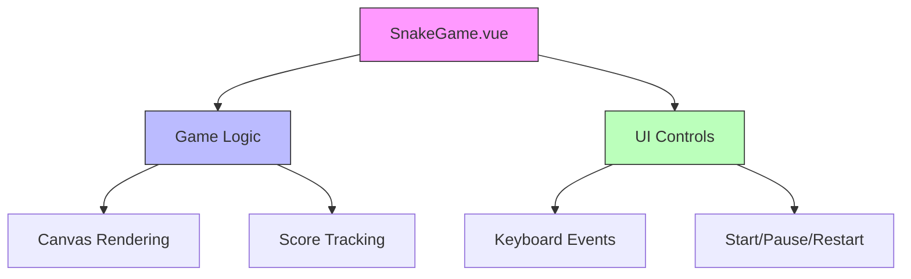

# Snake Game

A classic Snake game built with Vue.js and HTML5 Canvas.

## Features
- 🐍 Vue 3 Composition API
- 🎨 Canvas rendering
- 🎮 Keyboard controls (Arrow keys)
- ⏯️ Start/Pause/Restart functionality
- 📊 Score tracking

## Installation
1. Clone the repository:
```bash
git clone https://github.com/yourusername/snake.git
```

## Install dependencies:
```bash
npm install
```
## Usage
 Start the development server:
```bash
npm run dev
```
Open your browser and go to Open your browser and go to URL_ADDRESS:
http://localhost:5173/

## how to play
Open your browser and play the game. 
- Use the arrow keys to control the snake's direction.
- Eat the food to grow longer.
- Avoid colliding with the walls or your own body.
- The game ends when you collide.
- Click the "Restart" button to play again.     

## project structure


snake/
├── index.html
├── app.js
├── SnakeGame.vue
├── vite.config.js
└── package.json


##Technologies Used
- Vue.js
- HTML5 Canvas
- JavaScript

License
This project is licensed under the MIT License.


## Change Log

- `3f4d2ae` - iyangming, 5 hours ago
  - docs: update README.md with Vue.js details and project structure

- `c7d2ca6` - iyangming, 5 hours ago
  - feat: initialize Vue.js snake game with Vite build setup

- `a86f9ab` - iyangming, 6 hours ago
  - docs(game): translate comments and button text to English

- `adef98d` - iyangming, 6 hours ago
  - docs(game): translate game over message to English

- `3a09f6b` - iyangming, 6 hours ago
  - refactor(game): replace alert with gameOver function and ensure DOM loaded

- `ad096ba` - iyangming, 6 hours ago
  - feat: add game controls and improve UI styling

- `656de17` - iyangming, 6 hours ago
  - docs: add README.md and update game.js comments to English

- `841e15d` - iyangming, 6 hours ago
  - Initial commit - Snake game project
